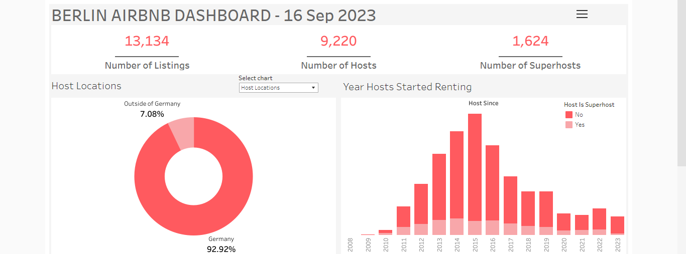
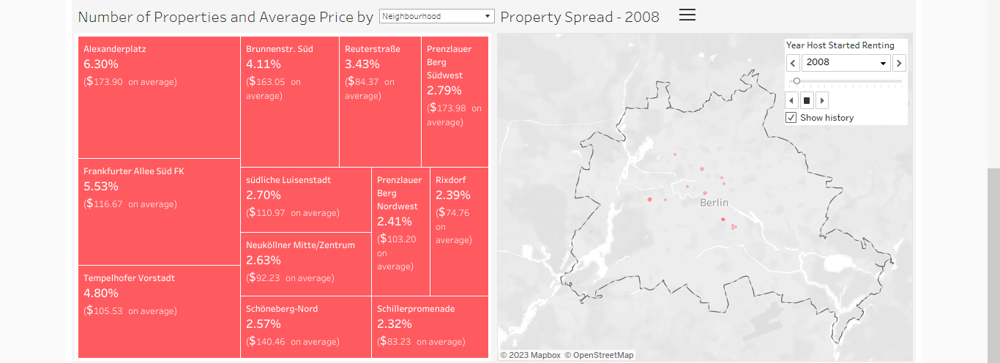
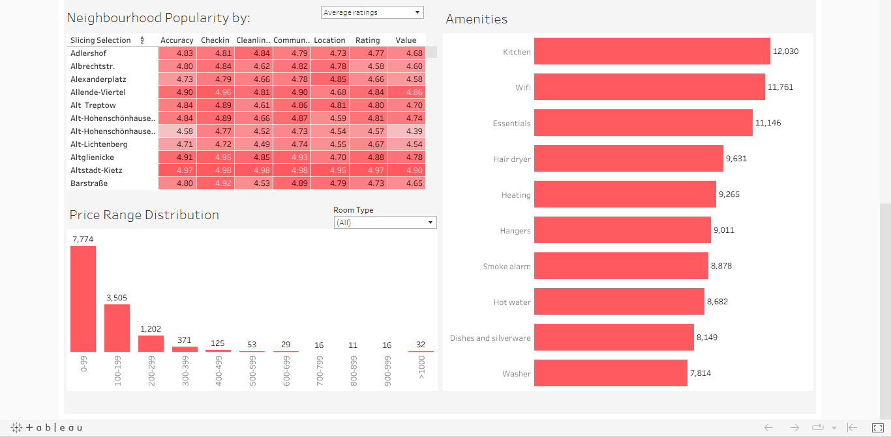
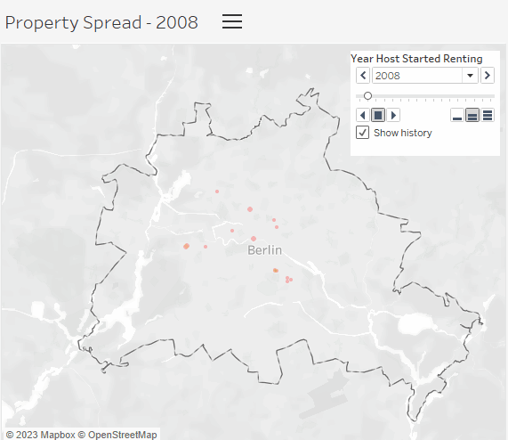

# Berlin Airbnb Analysis


**Airbnb data analysis project for the city of Berlin as of: September 16th, 2023.**

## 📚  Table of Contents
- [📄  Importing The Datasets (SQL)](https://github.com/mihaivlasceanu/Berlin-Airbnb-Data-Analysis#importing-the-datasets)
- [🧹 Cleaning the tables (SQL)](https://github.com/mihaivlasceanu/Berlin-Airbnb-Data-Analysis/blob/main/README.md#cleaning-the-tables)
- [🏠 Property Metrics (SQL)](https://github.com/mihaivlasceanu/Berlin-Airbnb-Data-Analysis#property-metrics)
- [👥 Host Metrics (SQL)](https://github.com/mihaivlasceanu/Berlin-Airbnb-Data-Analysis#host-metrics)
- [🏙️ Neighbourhood Metrics (SQL)](https://github.com/mihaivlasceanu/Berlin-Airbnb-Data-Analysis#neighbourhood-metrics)
- [📆 Booking/Availability Metrics (SQL)](https://github.com/mihaivlasceanu/Berlin-Airbnb-Data-Analysis#booking-availability-metrics)
- [🎨 Data Visualization (Tableau)](https://github.com/mihaivlasceanu/Berlin-Airbnb-Data-Analysis#data-visualization)

## Importing The Datasets
**Source:**  http://insideairbnb.com/get-the-data/
```sql
CREATE TABLE listings (
id TEXT,
host_id TEXT,
host_name TEXT,
host_since DATE,
host_location TEXT,
host_response_time TEXT,
host_response_rate TEXT,
host_acceptance_rate TEXT,
host_is_superhost BOOL,
host_neighbourhood TEXT,
host_listings_count INTEGER,
host_total_listings_count INTEGER,
neighbourhood_cleansed TEXT,
neighbourhood_group_cleansed TEXT,
latitude NUMERIC,
longitude NUMERIC,
property_type TEXT,
room_type TEXT,
accommodates INTEGER,	
bathrooms_text TEXT,
bedrooms INTEGER,
beds INTEGER,
amenities TEXT,
price TEXT,
minimum_nights INTEGER,
maximum_nights INTEGER,
has_availability BOOLEAN,
availability_30 INTEGER,
availability_60 INTEGER,
availability_90	INTEGER,
availability_365 INTEGER,
number_of_reviews INTEGER,
number_of_reviews_ltm INTEGER,
number_of_reviews_l30d INTEGER,
first_review DATE,
last_review DATE,
review_scores_rating NUMERIC,
review_scores_accuracy NUMERIC,
review_scores_cleanliness NUMERIC,	
review_scores_checkin NUMERIC,
review_scores_communication NUMERIC,
review_scores_location NUMERIC,
review_scores_value NUMERIC,
instant_bookable BOOLEAN,
calculated_host_listings_count INTEGER,
calculated_host_listings_count_entire_homes INTEGER,
calculated_host_listings_count_private_rooms INTEGER,
calculated_host_listings_count_shared_rooms INTEGER,
reviews_per_month NUMERIC
)

-- \COPY listings FROM 'C:\Users\User\Desktop\Airbnb\16.09.2023\listings.csv' WITH CSV HEADER DELIMITER ',' ENCODING 'UTF8'

SELECT * FROM listings
LIMIT 5
```
| id    | host_id | host_name      | host_since | host_location          | host_response_time | host_response_rate | host_acceptance_rate | host_is_superhost | host_neighbourhood | host_listings_count | host_total_listings_count | neighbourhood_cleansed   | neighbourhood_group_cleansed | latitude | longitude | property_type      | room_type       | accommodates | bathrooms_text | bedrooms | beds | amenities                                                                                                                                                                                                                                                                                                                                                                                                                                                                                                                                                | price   | minimum_nights | maximum_nights | has_availability | availability_30 | availability_60 | availability_90 | availability_365 | number_of_reviews | number_of_reviews_ltm | number_of_reviews_l30d | first_review | last_review | review_scores_rating | review_scores_accuracy | review_scores_cleanliness | review_scores_checkin | review_scores_communication | review_scores_location | review_scores_value | instant_bookable | calculated_host_listings_count | calculated_host_listings_count_entire_homes | calculated_host_listings_count_private_rooms | calculated_host_listings_count_shared_rooms | reviews_per_month |
|-------|---------|----------------|------------|------------------------|--------------------|--------------------|----------------------|-------------------|--------------------|---------------------|---------------------------|--------------------------|------------------------------|----------|-----------|--------------------|-----------------|--------------|----------------|----------|------|----------------------------------------------------------------------------------------------------------------------------------------------------------------------------------------------------------------------------------------------------------------------------------------------------------------------------------------------------------------------------------------------------------------------------------------------------------------------------------------------------------------------------------------------------------|---------|----------------|----------------|------------------|-----------------|-----------------|-----------------|------------------|-------------------|-----------------------|------------------------|--------------|-------------|----------------------|------------------------|---------------------------|-----------------------|-----------------------------|------------------------|---------------------|------------------|--------------------------------|---------------------------------------------|----------------------------------------------|---------------------------------------------|-------------------|
| 3176  | 3718    | Britta         | 2008-10-19 | Coledale, Australia    | N/A                | N/A                | 30%                  | false             | Prenzlauer Berg    | 1                   | 1                         | Prenzlauer Berg Südwest  | Pankow                       | 52.53471 | 13.4181   | Entire rental unit | Entire home/apt | 4            | 1 bath         | 1        | 2    | ["Kitchen", "Crib", "Essentials", "Patio or balcony", "Fire extinguisher", "Private hot tub", "Lockbox", "Wifi", "Heating", "Carbon monoxide alarm", "Coffee maker", "Cooking basics", "First aid kit", "Self check-in", "Iron", "Hair dryer", "Smoke alarm", "Washer", "Shampoo", "Hangers"]                                                                                                                                                                                                                                                            | $83.00  | 63             | 184            | true             | 0               | 3               | 33              | 123              | 148               | 1                     | 0                      | 2009-06-20   | 2023-05-25  | 4.63                 | 4.67                   | 4.52                      | 4.64                  | 4.69                        | 4.92                   | 4.62                | false            | 1                              | 1                                           | 0                                            | 0                                           | 0.85              |
| 9991  | 33852   | Philipp        | 2009-08-25 | Berlin, Germany        | N/A                | N/A                | 0%                   | false             | Prenzlauer Berg    | 1                   | 1                         | Prenzlauer Berg Südwest  | Pankow                       | 52.53269 | 13.41805  | Entire rental unit | Entire home/apt | 7            | 2.5 baths      | 4        | 7    | ["Refrigerator", "TV with standard cable", "Babysitter recommendations", "Room-darkening shades", "Iron", "Oven", "Dishwasher", "Crib", "Essentials", "Microwave", "Heating", "Pack \u2019n play/Travel crib", "Bathtub", "Children\u2019s books and toys", "Washer", "Kitchen", "Hangers", "Bed linens", "Smoke alarm", "Dryer", "Dishes and silverware", "Hot water", "Stove", "Paid parking off premises", "Wifi", "High chair", "Coffee maker", "Elevator", "Children\u2019s dinnerware", "Hair dryer", "Cooking basics", "Luggage dropoff allowed"] | $180.00 | 6              | 14             | true             | 0               | 0               | 0               | 137              | 8                 | 0                     | 0                      | 2015-08-09   | 2020-01-04  | 5                    | 5                      | 5                         | 5                     | 5                           | 4.86                   | 4.86                | false            | 1                              | 1                                           | 0                                            | 0                                           | 0.08              |
| 14325 | 55531   | Chris + Oliver | 2009-11-18 | Berlin, Germany        | within a few hours | 86%                | 29%                  | false             | Prenzlauer Berg    | 4                   | 5                         | Prenzlauer Berg Nordwest | Pankow                       | 52.54813 | 13.40366  | Entire rental unit | Entire home/apt | 1            | 1 bath         |          | 1    | ["Wifi", "TV", "Refrigerator", "Heating", "Coffee maker", "Ethernet connection", "Private entrance", "Host greets you", "Smoke alarm", "Washer", "Dishes and silverware", "Kitchen", "Hot water", "Hangers"]                                                                                                                                                                                                                                                                                                                                             | $70.00  | 150            | 1125           | true             | 0               | 0               | 13              | 288              | 26                | 0                     | 0                      | 2010-06-29   | 2021-06-21  | 4.67                 | 5                      | 4.84                      | 4.68                  | 4.84                        | 4.58                   | 4.42                | false            | 4                              | 4                                           | 0                                            | 0                                           | 0.16              |
| 16644 | 64696   | Rene           | 2009-12-20 | Santa Cruz, CA         | within a day       | 100%               | 50%                  | false             | Kreuzberg          | 4                   | 4                         | nördliche Luisenstadt    | Friedrichshain-Kreuzberg     | 52.50312 | 13.43508  | Entire condo       | Entire home/apt | 4            | 1 bath         | 1        | 1    | ["Kitchen", "Essentials", "Wifi", "TV", "High chair", "Pack \u2019n play/Travel crib", "Heating", "Carbon monoxide alarm", "First aid kit", "Room-darkening shades", "Hair dryer", "Smoke alarm", "Children\u2019s books and toys", "Washer", "Iron", "Shampoo", "Hangers"]                                                                                                                                                                                                                                                                              | $90.00  | 93             | 365            | true             | 0               | 0               | 0               | 131              | 48                | 0                     | 0                      | 2010-06-04   | 2017-12-14  | 4.72                 | 4.86                   | 4.86                      | 4.93                  | 4.86                        | 4.67                   | 4.71                | false            | 2                              | 2                                           | 0                                            | 0                                           | 0.3               |
| 17904 | 68997   | Matthias       | 2010-01-08 | Rio de Janeiro, Brazil | within an hour     | 100%               | 96%                  | true              | Copacabana         | 2                   | 5                         | Reuterstraße             | Neukölln                     | 52.49419 | 13.42166  | Entire rental unit | Entire home/apt | 2            | 1 bath         |          | 1    | ["Long term stays allowed", "Kitchen", "Essentials", "Wifi", "TV", "Refrigerator", "Building staff", "Heating", "Coffee maker", "Self check-in", "Iron", "Hair dryer", "Luggage dropoff allowed", "Free street parking", "Cooking basics", "Dishes and silverware", "Shampoo", "Hot water", "Hangers"]                                                                                                                                                                                                                                                   | $25.00  | 92             | 365            | true             | 0               | 0               | 0               | 10               | 299               | 1                     | 0                      | 2010-02-18   | 2022-12-01  | 4.77                 | 4.82                   | 4.71                      | 4.89                  | 4.92                        | 4.87                   | 4.65                | false            | 1                              | 1                                           | 0                                            | 0                                           | 1.81              |
```sql
CREATE TABLE reviews (
listing_id TEXT,
id TEXT,
date DATE,	
reviewer_id	TEXT,
reviewer_name TEXT,
comments TEXT
)

-- \COPY reviews FROM 'C:\Users\User\Desktop\Airbnb\16.09.2023\reviews.csv' WITH CSV HEADER DELIMITER ',' ENCODING 'UTF8'

SELECT * FROM reviews
LIMIT 5
```
| listing_id | id     | date       | reviewer_id | reviewer_name | comments                                                                                                                                                                                                                                                                                                                                                                                            |
|------------|--------|------------|-------------|---------------|-----------------------------------------------------------------------------------------------------------------------------------------------------------------------------------------------------------------------------------------------------------------------------------------------------------------------------------------------------------------------------------------------------|
| 3176       | 4283   | 2009-06-20 | 21475       | Milan         | excellent stay, i would highly recommend it. a nice flat in a very nice area. Britta provided clear instructions in securing the keys, etc. Thanks again.                                                                                                                                                                                                                                           |
| 3176       | 134722 | 2010-11-07 | 263467      | George        | Britta's apartment in Berlin is in a great area.  There are numerous fantastic Restaurants and Bars to suit every taste, easy access to supermarkets and public transportation. The apartment is also surprisingly large.  I would surely stay there again.                                                                                                                                         |
| 3176       | 144064 | 2010-11-24 | 76726       | Patricia      | Fantastic, large place in good location. Only a short tram ride to Alexanderplatz U-S Bahn, with connections across Berlin. Britta was quick to reply to all messages and gave very clear instructions regarding directions, key pick up and things to know about the place. Try Gargerin cafe around the corner for lovely and cheap continental breakfast. I definitely recommend this apartment! |
| 3176       | 156702 | 2010-12-21 | 291657      | Benedetta     | L'appartamento di Britta è molto largo carino confortabile è in un quartiere molto tranquillo e comodo perchè ci sono tanti supermercati e bar dove poter mangiare. Siamo stati benissimo spero di ripetere la bellissima esperienza ... magari in estate!<br/>ciao Benedetta                                                                                                                       |
| 3176       | 165048 | 2011-01-04 | 279789      | Aude          | We went in Berlin for the new year eve. The appartment of Britta was really amazing, very chic, cool and in a good district !<br/>You should go there !                                                                                                                                                                                                                                             |

## Cleaning the tables

**1. The "listings" table:**

```sql
WITH cleanup_cte AS (
SELECT
id,
host_id, 
host_name,
host_since,
SPLIT_PART(host_location, ',', 1) AS host_location_city,
SPLIT_PART(host_location, ',', 2) AS host_location_country,
NULLIF(host_response_time,'N/A') AS host_response_time,
NULLIF(REPLACE(host_response_rate,'%',''),'N/A') AS host_response_rate,
NULLIF(REPLACE(host_acceptance_rate,'%',''),'N/A') AS host_acceptance_rate,
host_is_superhost,
host_neighbourhood,	
host_listings_count,	
host_total_listings_count,
neighbourhood_cleansed,	
neighbourhood_group_cleansed,	
latitude,	
longitude,	
property_type,	
room_type,	
accommodates,
SPLIT_PART(bathrooms_text, ' ', 1) AS bathrooms,
bedrooms,
beds,
REGEXP_REPLACE(amenities,'[\[\]\"]', '', 'g') AS amenities,
SPLIT_PART(REPLACE(price, '$', ''), '.', 1) AS price_dollars, 
minimum_nights,	
maximum_nights,	
has_availability, 
availability_30,	
availability_60,	
availability_90,	
availability_365,	
number_of_reviews,	
number_of_reviews_ltm,	
number_of_reviews_l30d,	
first_review,	
last_review,	
review_scores_rating,	
review_scores_accuracy,	
review_scores_cleanliness, 	
review_scores_checkin,	
review_scores_communication,	
review_scores_location,	
review_scores_value,	
instant_bookable,	
calculated_host_listings_count, 
calculated_host_listings_count_entire_homes, 
calculated_host_listings_count_private_rooms, 
calculated_host_listings_count_shared_rooms,	
reviews_per_month 
FROM listings
)

, cleanup_cte_2 AS (
SELECT
id,
host_id, 
host_name,
host_since,
CASE WHEN host_location_country = '' AND host_location_city IS NOT NULL 
THEN host_location_city ELSE host_location_country END AS host_location_country,
host_location_city,
host_response_time,
host_response_rate,
host_acceptance_rate,
host_is_superhost,
host_neighbourhood,	
host_listings_count,	
host_total_listings_count,
neighbourhood_cleansed,	
neighbourhood_group_cleansed,	
latitude,	
longitude,	
property_type,	
room_type,	
accommodates,
bathrooms,
bedrooms,
beds,
REPLACE(REPLACE(REPLACE(amenities, '\u2019', '''), '\u2013', '-'), '\','"') AS amenities,
REPLACE(price_dollars, ',', '')::NUMERIC AS price_dollars,
minimum_nights,	
maximum_nights,	
has_availability, 
availability_30,	
availability_60,	
availability_90,	
availability_365,	
number_of_reviews,	
number_of_reviews_ltm,	
number_of_reviews_l30d,	
first_review,	
last_review,	
review_scores_rating,	
review_scores_accuracy,	
review_scores_cleanliness, 	
review_scores_checkin,	
review_scores_communication,	
review_scores_location,	
review_scores_value,	
instant_bookable,	
calculated_host_listings_count, 
calculated_host_listings_count_entire_homes, 
calculated_host_listings_count_private_rooms, 
calculated_host_listings_count_shared_rooms,	
reviews_per_month 
FROM cleanup_cte
)

SELECT
id,
host_id, 
host_name,
host_since,
TRIM(host_location_country) AS host_location_country,
TRIM(CASE WHEN host_location_city = host_location_country THEN 'Undeclared' ELSE host_location_city END) AS host_location_city,
host_response_time,
host_response_rate,
host_acceptance_rate,
host_is_superhost,
host_neighbourhood,	
host_listings_count,	
host_total_listings_count,
neighbourhood_cleansed,	
neighbourhood_group_cleansed,	
latitude,	
longitude,	
property_type,	
room_type,	
accommodates,
bathrooms,
bedrooms,
beds,
amenities,
price_dollars,
minimum_nights,	
maximum_nights,	
has_availability, 
availability_30,	
availability_60,	
availability_90,	
availability_365,	
number_of_reviews,	
number_of_reviews_ltm,	
number_of_reviews_l30d,	
first_review,	
last_review,	
review_scores_rating,	
review_scores_accuracy,	
review_scores_cleanliness, 	
review_scores_checkin,	
review_scores_communication,	
review_scores_location,	
review_scores_value,	
instant_bookable,	
calculated_host_listings_count, 
calculated_host_listings_count_entire_homes, 
calculated_host_listings_count_private_rooms, 
calculated_host_listings_count_shared_rooms,	
reviews_per_month 
INTO listings_cleaned
FROM cleanup_cte_2

SELECT * FROM listings_cleaned
LIMIT 5
```
| id    | host_id | host_name      | host_since | host_location_country | host_location_city | host_response_time | host_response_rate | host_acceptance_rate | host_is_superhost | host_neighbourhood | host_listings_count | host_total_listings_count | neighbourhood_cleansed   | neighbourhood_group_cleansed | latitude | longitude | property_type      | room_type       | accommodates | bathrooms | bedrooms | beds | amenities                                                                                                                                                                                                                                                                                                                                                                                                                                                               | price_dollars | minimum_nights | maximum_nights | has_availability | availability_30 | availability_60 | availability_90 | availability_365 | number_of_reviews | number_of_reviews_ltm | number_of_reviews_l30d | first_review | last_review | review_scores_rating | review_scores_accuracy | review_scores_cleanliness | review_scores_checkin | review_scores_communication | review_scores_location | review_scores_value | instant_bookable | calculated_host_listings_count | calculated_host_listings_count_entire_homes | calculated_host_listings_count_private_rooms | calculated_host_listings_count_shared_rooms | reviews_per_month |
|-------|---------|----------------|------------|-----------------------|--------------------|--------------------|--------------------|----------------------|-------------------|--------------------|---------------------|---------------------------|--------------------------|------------------------------|----------|-----------|--------------------|-----------------|--------------|-----------|----------|------|-------------------------------------------------------------------------------------------------------------------------------------------------------------------------------------------------------------------------------------------------------------------------------------------------------------------------------------------------------------------------------------------------------------------------------------------------------------------------|---------------|----------------|----------------|------------------|-----------------|-----------------|-----------------|------------------|-------------------|-----------------------|------------------------|--------------|-------------|----------------------|------------------------|---------------------------|-----------------------|-----------------------------|------------------------|---------------------|------------------|--------------------------------|---------------------------------------------|----------------------------------------------|---------------------------------------------|-------------------|
| 3176  | 3718    | Britta         | 2008-10-19 | Australia             | Coledale           |                    |                    | 30                   | false             | Prenzlauer Berg    | 1                   | 1                         | Prenzlauer Berg Südwest  | Pankow                       | 52.53471 | 13.4181   | Entire rental unit | Entire home/apt | 4            | 1         | 1        | 2    | Kitchen, Crib, Essentials, Patio or balcony, Fire extinguisher, Private hot tub, Lockbox, Wifi, Heating, Carbon monoxide alarm, Coffee maker, Cooking basics, First aid kit, Self check-in, Iron, Hair dryer, Smoke alarm, Washer, Shampoo, Hangers                                                                                                                                                                                                                     | 83            | 63             | 184            | true             | 0               | 3               | 33              | 123              | 148               | 1                     | 0                      | 2009-06-20   | 2023-05-25  | 4.63                 | 4.67                   | 4.52                      | 4.64                  | 4.69                        | 4.92                   | 4.62                | false            | 1                              | 1                                           | 0                                            | 0                                           | 0.85              |
| 9991  | 33852   | Philipp        | 2009-08-25 | Germany               | Berlin             |                    |                    | 0                    | false             | Prenzlauer Berg    | 1                   | 1                         | Prenzlauer Berg Südwest  | Pankow                       | 52.53269 | 13.41805  | Entire rental unit | Entire home/apt | 7            | 2.5       | 4        | 7    | Refrigerator, TV with standard cable, Babysitter recommendations, Room-darkening shades, Iron, Oven, Dishwasher, Crib, Essentials, Microwave, Heating, Pack 'n play/Travel crib, Bathtub, Children's books and toys, Washer, Kitchen, Hangers, Bed linens, Smoke alarm, Dryer, Dishes and silverware, Hot water, Stove, Paid parking off premises, Wifi, High chair, Coffee maker, Elevator, Children's dinnerware, Hair dryer, Cooking basics, Luggage dropoff allowed | 180           | 6              | 14             | true             | 0               | 0               | 0               | 137              | 8                 | 0                     | 0                      | 2015-08-09   | 2020-01-04  | 5                    | 5                      | 5                         | 5                     | 5                           | 4.86                   | 4.86                | false            | 1                              | 1                                           | 0                                            | 0                                           | 0.08              |
| 14325 | 55531   | Chris + Oliver | 2009-11-18 | Germany               | Berlin             | within a few hours | 86                 | 29                   | false             | Prenzlauer Berg    | 4                   | 5                         | Prenzlauer Berg Nordwest | Pankow                       | 52.54813 | 13.40366  | Entire rental unit | Entire home/apt | 1            | 1         |          | 1    | Wifi, TV, Refrigerator, Heating, Coffee maker, Ethernet connection, Private entrance, Host greets you, Smoke alarm, Washer, Dishes and silverware, Kitchen, Hot water, Hangers                                                                                                                                                                                                                                                                                          | 70            | 150            | 1125           | true             | 0               | 0               | 13              | 288              | 26                | 0                     | 0                      | 2010-06-29   | 2021-06-21  | 4.67                 | 5                      | 4.84                      | 4.68                  | 4.84                        | 4.58                   | 4.42                | false            | 4                              | 4                                           | 0                                            | 0                                           | 0.16              |
| 16644 | 64696   | Rene           | 2009-12-20 | CA                    | Santa Cruz         | within a day       | 100                | 50                   | false             | Kreuzberg          | 4                   | 4                         | nördliche Luisenstadt    | Friedrichshain-Kreuzberg     | 52.50312 | 13.43508  | Entire condo       | Entire home/apt | 4            | 1         | 1        | 1    | Kitchen, Essentials, Wifi, TV, High chair, Pack 'n play/Travel crib, Heating, Carbon monoxide alarm, First aid kit, Room-darkening shades, Hair dryer, Smoke alarm, Children's books and toys, Washer, Iron, Shampoo, Hangers                                                                                                                                                                                                                                           | 90            | 93             | 365            | true             | 0               | 0               | 0               | 131              | 48                | 0                     | 0                      | 2010-06-04   | 2017-12-14  | 4.72                 | 4.86                   | 4.86                      | 4.93                  | 4.86                        | 4.67                   | 4.71                | false            | 2                              | 2                                           | 0                                            | 0                                           | 0.3               |
| 17904 | 68997   | Matthias       | 2010-01-08 | Brazil                | Rio de Janeiro     | within an hour     | 100                | 96                   | true              | Copacabana         | 2                   | 5                         | Reuterstraße             | Neukölln                     | 52.49419 | 13.42166  | Entire rental unit | Entire home/apt | 2            | 1         |          | 1    | Long term stays allowed, Kitchen, Essentials, Wifi, TV, Refrigerator, Building staff, Heating, Coffee maker, Self check-in, Iron, Hair dryer, Luggage dropoff allowed, Free street parking, Cooking basics, Dishes and silverware, Shampoo, Hot water, Hangers                                                                                                                                                                                                          | 25            | 92             | 365            | true             | 0               | 0               | 0               | 10               | 299               | 1                     | 0                      | 2010-02-18   | 2022-12-01  | 4.77                 | 4.82                   | 4.71                      | 4.89                  | 4.92                        | 4.87                   | 4.65                | false            | 1                              | 1                                           | 0                                            | 0                                           | 1.81              |


**1.1  Exporting the cleaned listings table for further use in Tableau (using psql):**

```sql
-- \COPY listings_cleaned TO 'C:\Users\User\Desktop\Airbnb\Modified datasets\16 Sep 2023\listings_cleaned.csv' WITH CSV HEADER DELIMITER ',' ENCODING 'UTF8'
```
**2. The "reviews" table:**

```sql
SELECT
listing_id,
id,
date,
reviewer_id,
reviewer_name,
REPLACE(comments,'<br/>','') AS comments
INTO reviews_cleaned
FROM reviews

SELECT * FROM reviews_cleaned
LIMIT 5
```
| listing_id | id     | date       | reviewer_id | reviewer_name | comments                                                                                                                                                                                                                                                                                                                                                                                            |
|------------|--------|------------|-------------|---------------|-----------------------------------------------------------------------------------------------------------------------------------------------------------------------------------------------------------------------------------------------------------------------------------------------------------------------------------------------------------------------------------------------------|
| 3176       | 4283   | 2009-06-20 | 21475       | Milan         | excellent stay, i would highly recommend it. a nice flat in a very nice area. Britta provided clear instructions in securing the keys, etc. Thanks again.                                                                                                                                                                                                                                           |
| 3176       | 134722 | 2010-11-07 | 263467      | George        | Britta's apartment in Berlin is in a great area.  There are numerous fantastic Restaurants and Bars to suit every taste, easy access to supermarkets and public transportation. The apartment is also surprisingly large.  I would surely stay there again.                                                                                                                                         |
| 3176       | 144064 | 2010-11-24 | 76726       | Patricia      | Fantastic, large place in good location. Only a short tram ride to Alexanderplatz U-S Bahn, with connections across Berlin. Britta was quick to reply to all messages and gave very clear instructions regarding directions, key pick up and things to know about the place. Try Gargerin cafe around the corner for lovely and cheap continental breakfast. I definitely recommend this apartment! |
| 3176       | 156702 | 2010-12-21 | 291657      | Benedetta     | L'appartamento di Britta è molto largo carino confortabile è in un quartiere molto tranquillo e comodo perchè ci sono tanti supermercati e bar dove poter mangiare. Siamo stati benissimo spero di ripetere la bellissima esperienza ... magari in estate!ciao Benedetta                                                                                                                            |
| 3176       | 165048 | 2011-01-04 | 279789      | Aude          | We went in Berlin for the new year eve. The appartment of Britta was really amazing, very chic, cool and in a good district !You should go there !                                                                                                                                                                                                                                                  |

## Property Metrics

**1. Total number of listings**
```sql
SELECT
COUNT(DISTINCT id)
FROM listings_cleaned
```
| count |
|-------|
| 13134 |

**2. Distribution of property types (absolute and percent of total)**
```sql
SELECT
property_type,
COUNT(*),
ROUND(100.0 * COUNT(*)/SUM(COUNT(*)) OVER (),2) as pct
FROM listings_cleaned
GROUP BY 1
ORDER BY 2 DESC
LIMIT 10
```
| property_type               | count | pct   |
|-----------------------------|-------|-------|
| Entire rental unit          | 6545  | 49.83 |
| Private room in rental unit | 3261  | 24.83 |
| Entire condo                | 756   | 5.76  |
| Entire serviced apartment   | 407   | 3.10  |
| Room in hotel               | 297   | 2.26  |
| Entire loft                 | 264   | 2.01  |
| Private room in condo       | 253   | 1.93  |
| Private room in home        | 177   | 1.35  |
| Shared room in rental unit  | 153   | 1.16  |
| Entire home                 | 151   | 1.15  |

**3. Distribution of room types (aggregated, absolute and percent of total)**
```sql
SELECT
room_type,
COUNT(*),
ROUND(100.0 * COUNT(*)/SUM(COUNT(*)) OVER (),2) as pct
FROM listings_cleaned
GROUP BY 1
ORDER BY 2 DESC
```
| room_type       | count | pct   |
|-----------------|-------|-------|
| Entire home/apt | 8431  | 64.19 |
| Private room    | 4309  | 32.81 |
| Shared room     | 262   | 1.99  |
| Hotel room      | 132   | 1.01  |

**4. Average number of bedrooms and beds**
```sql
SELECT
ROUND(AVG(bedrooms)) AS avg_nr_bedrooms,
ROUND(AVG(beds)) AS avg_nr_beds
FROM listings_cleaned
```
| avg_nr_bedrooms | avg_nr_beds |
|-----------------|-------------|
| 1               | 2           |

**5. Average, min, max price per night**
(NOTE: there are a handful of outliers at the upper limit of the overall prince range that could potentially affect our results further down the line)
```sql
SELECT
ROUND(AVG(price_dollars)) AS avg_price,
ROUND(MIN(price_dollars)) AS min_price,
ROUND(MAX(price_dollars)) AS max_price
FROM listings_cleaned
```
| avg_price | min_price | max_price |
|-----------|-----------|-----------|
| 122       | 8         | 24999     |

**6. Price range distribution**
```sql
WITH price_range_cte AS (
SELECT
CASE WHEN price_dollars < 100 THEN '0-99'
WHEN price_dollars >=100 AND price_dollars < 200 THEN '100-199'
WHEN price_dollars >=200 AND price_dollars < 300 THEN '200-299'
WHEN price_dollars >=300 AND price_dollars < 400 THEN '300-399'
WHEN price_dollars >=400 AND price_dollars < 500 THEN '400-499'
WHEN price_dollars >=500 AND price_dollars < 600 THEN '500-599'
WHEN price_dollars >=600 AND price_dollars < 700 THEN '600-699'
WHEN price_dollars >=700 AND price_dollars < 800 THEN '700-799'
WHEN price_dollars >=800 AND price_dollars < 900 THEN '800-899'
WHEN price_dollars >=900 AND price_dollars < 1000 THEN '900-999'
ELSE '>1000' END AS price_range,
COUNT(*)
FROM listings_cleaned
GROUP BY 1
)

SELECT
price_range,
count,
ROUND(100.0 * count/SUM(count) OVER (), 2) as pct
FROM price_range_cte
ORDER BY ARRAY_POSITION(ARRAY['0-99','100-199','200-299','300-399','400-499','500-599','600-699','700-799','800-899','900-999','>1000'], price_range)

```
| price_range | count | pct   |
|-------------|-------|-------|
| 0-99        | 7774  | 59.19 |
| 100-199     | 3505  | 26.69 |
| 200-299     | 1202  | 9.15  |
| 300-399     | 371   | 2.82  |
| 400-499     | 125   | 0.95  |
| 500-599     | 53    | 0.40  |
| 600-699     | 29    | 0.22  |
| 700-799     | 16    | 0.12  |
| 800-899     | 11    | 0.08  |
| 900-999     | 16    | 0.12  |
| >1000       | 32    | 0.24  |

**6.1 Price range distribution by neighbourhood**
```sql
WITH price_range_cte AS (
SELECT
neighbourhood_cleansed,
CASE WHEN price_dollars < 100 THEN '0-99'
WHEN price_dollars >=100 AND price_dollars < 200 THEN '100-199'
WHEN price_dollars >=200 AND price_dollars < 300 THEN '200-299'
WHEN price_dollars >=300 AND price_dollars < 400 THEN '300-399'
WHEN price_dollars >=400 AND price_dollars < 500 THEN '400-499'
WHEN price_dollars >=500 AND price_dollars < 600 THEN '500-599'
WHEN price_dollars >=600 AND price_dollars < 700 THEN '600-699'
WHEN price_dollars >=700 AND price_dollars < 800 THEN '700-799'
WHEN price_dollars >=800 AND price_dollars < 900 THEN '800-899'
WHEN price_dollars >=900 AND price_dollars < 1000 THEN '900-999'
ELSE '>1000' END AS price_range,
COUNT(*)
FROM listings_cleaned
GROUP BY 1,2
)

SELECT
neighbourhood_cleansed,
price_range,
count,
ROUND(100.0 * count/SUM(count) OVER (PARTITION BY neighbourhood_cleansed), 2) as pct
FROM price_range_cte
ORDER BY ARRAY_POSITION(ARRAY['0-99','100-199','200-299','300-399','400-499','500-599','600-699','700-799','800-899','900-999','>1000'], price_range)
LIMIT 10
```
| neighbourhood_cleansed    | price_range | count | pct    |
|---------------------------|-------------|-------|--------|
| Alt  Treptow              | 0-99        | 66    | 66.67  |
| Altglienicke              | 0-99        | 20    | 86.96  |
| Alt-Hohenschönhausen Nord | 0-99        | 6     | 60.00  |
| Alt-Lichtenberg           | 0-99        | 37    | 69.81  |
| Albrechtstr.              | 0-99        | 47    | 77.05  |
| Alexanderplatz            | 0-99        | 282   | 34.06  |
| Adlershof                 | 0-99        | 23    | 57.50  |
| Allende-Viertel           | 0-99        | 3     | 100.00 |
| Alt-Hohenschönhausen Süd  | 0-99        | 8     | 47.06  |
| Altstadt-Kietz            | 0-99        | 4     | 66.67  |
**6.2 Price range distribution by neighbourhood_group**
```sql
WITH price_range_cte AS (
SELECT
neighbourhood_group_cleansed,
CASE WHEN price_dollars < 100 THEN '0-99'
WHEN price_dollars >=100 AND price_dollars < 200 THEN '100-199'
WHEN price_dollars >=200 AND price_dollars < 300 THEN '200-299'
WHEN price_dollars >=300 AND price_dollars < 400 THEN '300-399'
WHEN price_dollars >=400 AND price_dollars < 500 THEN '400-499'
WHEN price_dollars >=500 AND price_dollars < 600 THEN '500-599'
WHEN price_dollars >=600 AND price_dollars < 700 THEN '600-699'
WHEN price_dollars >=700 AND price_dollars < 800 THEN '700-799'
WHEN price_dollars >=800 AND price_dollars < 900 THEN '800-899'
WHEN price_dollars >=900 AND price_dollars < 1000 THEN '900-999'
ELSE '>1000' END AS price_range,
COUNT(*)
FROM listings_cleaned
GROUP BY 1,2
)

SELECT
neighbourhood_group_cleansed,
price_range,
count,
ROUND(100.0 * count/SUM(count) OVER (PARTITION BY neighbourhood_group_cleansed), 2) as pct
FROM price_range_cte
ORDER BY ARRAY_POSITION(ARRAY['0-99','100-199','200-299','300-399','400-499','500-599','600-699','700-799','800-899','900-999','>1000'], price_range)
LIMIT 10
```
| neighbourhood_group_cleansed | price_range | count | pct   |
|------------------------------|-------------|-------|-------|
| Reinickendorf                | 0-99        | 154   | 76.24 |
| Spandau                      | 0-99        | 165   | 79.71 |
| Neukölln                     | 0-99        | 1151  | 74.02 |
| Pankow                       | 0-99        | 1157  | 56.22 |
| Marzahn - Hellersdorf        | 0-99        | 76    | 71.70 |
| Charlottenburg-Wilm.         | 0-99        | 659   | 54.51 |
| Mitte                        | 0-99        | 1407  | 49.66 |
| Friedrichshain-Kreuzberg     | 0-99        | 1674  | 58.31 |
| Lichtenberg                  | 0-99        | 228   | 66.09 |
| Steglitz - Zehlendorf        | 0-99        | 208   | 67.97 |

**7. Average number of amenities per rentable property**
```sql
WITH amenities_cte AS (
SELECT
id,
UNNEST(STRING_TO_ARRAY(amenities, ',')) AS amenities
FROM listings_cleaned
)

, amenities_count AS (
SELECT
id,
COUNT(amenities)
FROM amenities_cte
GROUP BY 1
ORDER BY 2 DESC
)

SELECT
ROUND(AVG(count))
FROM amenities_count
```
| round |
|-------|
| 25    |

**8. Most common amenities**
```sql
WITH amenities_cte AS (
SELECT
id,
TRIM(UNNEST(STRING_TO_ARRAY(amenities, ','))) AS amenities
FROM listings_cleaned
)

SELECT
amenities,
COUNT(*)
FROM amenities_cte
GROUP BY 1
ORDER BY 2 DESC
LIMIT 10
```
| amenities             | count |
|-----------------------|-------|
| Kitchen               | 12030 |
| Wifi                  | 11761 |
| Essentials            | 11146 |
| Hair dryer            | 9631  |
| Heating               | 9265  |
| Hangers               | 9011  |
| Smoke alarm           | 8878  |
| Hot water             | 8682  |
| Dishes and silverware | 8149  |
| Washer                | 7814  |

**8.1 Exporting the above CTE (property ids and their corresponding amenities) for later use in Tableau**
```sql
SELECT
id,
TRIM(UNNEST(STRING_TO_ARRAY(amenities, ','))) AS amenities
INTO amenities_split
FROM listings_cleaned

SELECT * FROM amenities_split

--\COPY amenities_split TO 'C:\Users\User\Desktop\Airbnb\Modified datasets\16 Sep 2023\amenities_split.csv' WITH CSV HEADER DELIMITER ','
```

**8.2 Most common amenities by neighbourhood**
```sql
WITH amenities_neighbourhood_cte AS (
SELECT
id,
neighbourhood_cleansed,
TRIM(UNNEST(STRING_TO_ARRAY(amenities, ','))) AS amenities
FROM listings_cleaned
)

SELECT
neighbourhood_cleansed,
amenities,
COUNT(*)
FROM amenities_neighbourhood_cte
GROUP BY 1,2
ORDER BY 1, 3 DESC
LIMIT 10
```
| neighbourhood_cleansed | amenities    | count |
|------------------------|--------------|-------|
| Adlershof              | Wifi         | 35    |
| Adlershof              | Kitchen      | 33    |
| Adlershof              | Smoke alarm  | 33    |
| Adlershof              | Hair dryer   | 32    |
| Adlershof              | Heating      | 29    |
| Adlershof              | Refrigerator | 27    |
| Adlershof              | Hot water    | 27    |
| Adlershof              | Bed linens   | 26    |
| Adlershof              | Washer       | 25    |
| Adlershof              | TV           | 24    |


**8.3 Most common amenities by neighbourhood_group**
```sql
WITH amenities_neighbourhood_cte AS (
SELECT
id,
neighbourhood_group_cleansed,
TRIM(UNNEST(STRING_TO_ARRAY(amenities, ','))) AS amenities
FROM listings_cleaned
)

SELECT
neighbourhood_group_cleansed,
amenities,
COUNT(*)
FROM amenities_neighbourhood_cte
GROUP BY 1,2
ORDER BY 1, 3 DESC
LIMIT 10
```
| neighbourhood_group_cleansed | amenities             | count |
|------------------------------|-----------------------|-------|
| Charlottenburg-Wilm.         | Wifi                  | 1101  |
| Charlottenburg-Wilm.         | Kitchen               | 1061  |
| Charlottenburg-Wilm.         | Essentials            | 1032  |
| Charlottenburg-Wilm.         | Hair dryer            | 942   |
| Charlottenburg-Wilm.         | Hangers               | 890   |
| Charlottenburg-Wilm.         | Heating               | 863   |
| Charlottenburg-Wilm.         | Smoke alarm           | 859   |
| Charlottenburg-Wilm.         | Hot water             | 850   |
| Charlottenburg-Wilm.         | Iron                  | 824   |
| Charlottenburg-Wilm.         | Dishes and silverware | 749   |


## Host Metrics

**1. Number of hosts and superhosts**
```sql
WITH hosts_cte AS (
SELECT
DISTINCT host_id,
host_is_superhost
FROM listings_cleaned
)

SELECT
COUNT(host_id) AS nr_hosts,
COUNT(host_is_superhost) FILTER (WHERE host_is_superhost = 'true') AS nr_superhosts,
ROUND(100.0 * COUNT(host_is_superhost) FILTER (WHERE host_is_superhost = 'true') / COUNT(host_id),2) AS pct_superhosts
FROM hosts_cte
```
| nr_hosts | nr_superhosts | pct_superhosts |
|----------|---------------|----------------|
| 9220     | 1624          | 17.61          |

**2. Distribution of number of listings per host**
```sql
WITH listings_per_host_cte AS (
SELECT
DISTINCT host_id,
COUNT(id) AS nr_listings_per_host
FROM listings_cleaned
GROUP BY 1
ORDER BY 2 DESC
)

SELECT
nr_listings_per_host,
COUNT(*),
ROUND(100.0 * COUNT(*)/SUM(COUNT(*)) OVER (), 2) AS pct
FROM listings_per_host_cte
GROUP BY 1
ORDER BY 2 DESC
```
| nr_listings_per_host | count | pct   |
|----------------------|-------|-------|
| 1                    | 8012  | 86.90 |
| 2                    | 686   | 7.44  |
| 3                    | 194   | 2.10  |
| 4                    | 94    | 1.02  |
| 5                    | 46    | 0.50  |
| 6                    | 41    | 0.44  |
| 7                    | 36    | 0.39  |
| 8                    | 24    | 0.26  |
| 9                    | 19    | 0.21  |
| 10                   | 15    | 0.16  |

**3. Average number of listings per host**
```sql
WITH listings_per_host_cte AS (
SELECT
DISTINCT host_id,
COUNT(id)
FROM listings_cleaned
GROUP BY 1
)

SELECT
ROUND(AVG(count),1)
FROM listings_per_host_cte
```
| round |
|-------|
| 1.4   |

**4. Host tenures (at time of data collection)**
```sql
SELECT
DISTINCT host_id,
AGE(MAKE_DATE(2023, 09, 16), host_since) AS tenure
FROM listings_cleaned
LIMIT 10
```
| host_id   | tenure                  |
|-----------|-------------------------|
| 4655176   | 10 years 8 mons 6 days  |
| 4264487   | 10 years 9 mons 19 days |
| 20549586  | 9 years 21 days         |
| 200759462 | 5 years 2 mons 8 days   |
| 24262329  | 8 years 9 mons 18 days  |
| 30951345  | 8 years 5 mons 6 days   |
| 155937178 | 5 years 10 mons 24 days |
| 120193237 | 6 years 6 mons 5 days   |
| 342931154 | 3 years 5 mons 15 days  |
| 6496447   | 10 years 3 mons 26 days |

**5. Average host tenure (at time of data collection)**
```sql
SELECT
ROUND(AVG(MAKE_DATE(2023, 09, 16) - host_since)) AS avg_tenure_days,
ROUND(AVG(MAKE_DATE(2023, 09, 16) - host_since)/365) AS avg_tenure_years
FROM listings_cleaned
```
| avg_tenure_days | avg_tenure_years |
|-----------------|------------------|
| 2546            | 7                |

**6. Distribution of years when host started renting out (absolute + percentage)**
```sql
WITH host_tenures_cte AS (
SELECT
DISTINCT host_id,
host_since
FROM listings_cleaned
)

SELECT
DATE_PART('year', host_since) AS year_host_started_renting,
COUNT(*),
ROUND(100.0 * COUNT(*) / SUM(COUNT(*)) OVER (), 2) AS pct
FROM host_tenures_cte
WHERE DATE_PART('year', host_since) IS NOT NULL
GROUP BY 1
ORDER BY 1
```
| year_host_started_renting | count | pct   |
|---------------------------|-------|-------|
| 2008                      | 3     | 0.03  |
| 2009                      | 9     | 0.10  |
| 2010                      | 68    | 0.74  |
| 2011                      | 369   | 4.01  |
| 2012                      | 664   | 7.21  |
| 2013                      | 1045  | 11.35 |
| 2014                      | 1335  | 14.49 |
| 2015                      | 1563  | 16.97 |
| 2016                      | 1156  | 12.55 |
| 2017                      | 761   | 8.26  |
| 2018                      | 562   | 6.10  |
| 2019                      | 563   | 6.11  |
| 2020                      | 274   | 2.97  |
| 2021                      | 256   | 2.78  |
| 2022                      | 341   | 3.70  |
| 2023                      | 242   | 2.63  |

**7. Distribution of host response times (absolute + percentage)**
```sql
WITH host_response_times_cte AS (
SELECT
DISTINCT host_id,
host_response_time
FROM listings_cleaned
)

SELECT
host_response_time,
COUNT(*),
ROUND(100.0 * COUNT(*) / SUM(COUNT(*)) OVER (), 2) AS pct
FROM host_response_times_cte
WHERE host_response_time IS NOT NULL
GROUP BY 1
ORDER BY 2 DESC
```
| host_response_time | count | pct   |
|--------------------|-------|-------|
| within an hour     | 2461  | 52.97 |
| within a few hours | 1058  | 22.77 |
| within a day       | 902   | 19.41 |
| a few days or more | 225   | 4.84  |

**8. Distribution of host acceptance rates (absolute + percentage)**
```sql
WITH host_acceptance_rate_cte AS (
SELECT
DISTINCT host_id,
host_acceptance_rate::INTEGER
FROM listings_cleaned
)

SELECT
host_acceptance_rate,
COUNT(*),
ROUND(100.0 * COUNT(*) / SUM(COUNT(*)) OVER (), 2) AS pct
FROM host_acceptance_rate_cte
WHERE host_acceptance_rate IS NOT NULL
GROUP BY 1
ORDER BY 1 DESC
LIMIT 10
```
| host_acceptance_rate | count | pct   |
|----------------------|-------|-------|
| 100                  | 1806  | 33.57 |
| 99                   | 183   | 3.40  |
| 98                   | 162   | 3.01  |
| 97                   | 122   | 2.27  |
| 96                   | 107   | 1.99  |
| 95                   | 76    | 1.41  |
| 94                   | 97    | 1.80  |
| 93                   | 80    | 1.49  |
| 92                   | 76    | 1.41  |
| 91                   | 72    | 1.34  |

**9. Distribution of host locations (absolute + percentage)**
```sql
WITH host_locations_cte AS (
SELECT 
DISTINCT host_id,
host_location_country,
host_location_city
FROM listings_cleaned
WHERE host_location_country IS NOT NULL
)

SELECT
host_location_country,
COUNT(*),
ROUND(100.0 * COUNT(*)/SUM(COUNT(*)) OVER (),2) AS pct
FROM host_locations_cte
GROUP BY 1
ORDER BY 2 DESC
```
| host_location_country | count | pct   |
|-----------------------|-------|-------|
| Germany               | 7403  | 92.92 |
| United Kingdom        | 59    | 0.74  |
| France                | 53    | 0.67  |
| Italy                 | 50    | 0.63  |
| Spain                 | 38    | 0.48  |
| Switzerland           | 36    | 0.45  |
| NY                    | 26    | 0.33  |
| Australia             | 21    | 0.26  |
| Austria               | 20    | 0.25  |
| Israel                | 17    | 0.21  |

**10. Distribution of host locations, for hosts based in Germany only (absolute + percentage)**
```sql
WITH host_locations_cte AS (
SELECT 
DISTINCT host_id,
host_location_country,
host_location_city
FROM listings_cleaned
WHERE host_location_country IS NOT NULL
)

SELECT
host_location_city,
COUNT(*),
ROUND(100.0 * COUNT(*)/SUM(COUNT(*)) OVER (),2) AS pct
FROM host_locations_cte
WHERE host_location_country ILIKE '%germany%'
GROUP BY 1
ORDER BY 2 DESC
```
| host_location_city | count | pct   |
|--------------------|-------|-------|
| Berlin             | 6843  | 92.44 |
| Undeclared         | 143   | 1.93  |
| Munich             | 56    | 0.76  |
| Hamburg            | 49    | 0.66  |
| Cologne            | 31    | 0.42  |
| Frankfurt          | 20    | 0.27  |
| Potsdam            | 7     | 0.09  |
| Stuttgart          | 7     | 0.09  |
| Dresden            | 5     | 0.07  |
| Freiburg           | 5     | 0.07  |

**11. Average ratings per host**
```sql
WITH host_ratings_cte AS (
SELECT
DISTINCT host_id,
ROUND(AVG(review_scores_rating), 2) AS avg_review_scores_rating,
ROUND(AVG(review_scores_accuracy), 2) AS avg_review_scores_accuracy,
ROUND(AVG(review_scores_cleanliness), 2) AS avg_review_scores_cleanliness,
ROUND(AVG(review_scores_checkin), 2) AS avg_review_scores_checkin,
ROUND(AVG(review_scores_communication), 2) AS avg_review_scores_communication,
ROUND(AVG(review_scores_location), 2) AS avg_review_scores_location,
ROUND(AVG(review_scores_value), 2) AS avg_review_scores_value
FROM listings_cleaned
WHERE review_scores_rating IS NOT NULL
AND review_scores_accuracy IS NOT NULL
AND review_scores_cleanliness IS NOT NULL
AND review_scores_checkin IS NOT NULL
AND review_scores_communication IS NOT NULL
AND review_scores_location IS NOT NULL
AND review_scores_value IS NOT NULL
GROUP BY 1

)

SELECT
host_id,
ROUND((avg_review_scores_rating + avg_review_scores_accuracy + avg_review_scores_cleanliness + avg_review_scores_checkin + avg_review_scores_communication + avg_review_scores_location + avg_review_scores_value) / 7, 2) AS overall_rating
FROM host_ratings_cte
LIMIT 10
```
| host_id   | overall_rating |
|-----------|----------------|
| 10004699  | 4.97           |
| 100078590 | 4.90           |
| 10009328  | 4.98           |
| 10014852  | 4.80           |
| 100215323 | 4.93           |
| 1003245   | 4.67           |
| 100326806 | 4.91           |
| 100374748 | 4.71           |
| 10039278  | 4.75           |
| 100497956 | 4.54           |

**12. Number of reviews per host**
```sql
SELECT
DISTINCT host_id,
COUNT(number_of_reviews)
FROM listings_cleaned
GROUP BY 1
ORDER BY 2 DESC
```
| host_id   | count |
|-----------|-------|
| 434485440 | 187   |
| 367035318 | 114   |
| 480052472 | 113   |
| 418270816 | 76    |
| 529388435 | 67    |
| 449692327 | 58    |
| 335573202 | 50    |
| 454962512 | 49    |
| 8250486   | 49    |
| 210700814 | 44    |

## Neighbourhood Metrics

**1. Distribution of properties by neighbourhood (absolute + percentage)**
```sql
SELECT
neighbourhood_cleansed,
COUNT(*),
ROUND(100.0 * COUNT(*)/SUM(COUNT(*)) OVER (),2) AS pct
FROM listings_cleaned
GROUP BY 1
ORDER BY 2 DESC
```
| neighbourhood_cleansed   | count | pct  |
|--------------------------|-------|------|
| Alexanderplatz           | 828   | 6.30 |
| Frankfurter Allee Süd FK | 726   | 5.53 |
| Tempelhofer Vorstadt     | 631   | 4.80 |
| Brunnenstr. Süd          | 540   | 4.11 |
| Reuterstraße             | 450   | 3.43 |
| Prenzlauer Berg Südwest  | 367   | 2.79 |
| südliche Luisenstadt     | 355   | 2.70 |
| Neuköllner Mitte/Zentrum | 346   | 2.63 |
| Schöneberg-Nord          | 338   | 2.57 |
| Prenzlauer Berg Nordwest | 316   | 2.41 |

**2. Distribution of properties by neighbourhood_group (absolute + percentage)**
```sql
SELECT
neighbourhood_group_cleansed,
COUNT(*),
ROUND(100.0 * COUNT(*)/SUM(COUNT(*)) OVER (),2) AS pct
FROM listings_cleaned
GROUP BY 1
ORDER BY 2 DESC
```
| neighbourhood_group_cleansed | count | pct   |
|------------------------------|-------|-------|
| Friedrichshain-Kreuzberg     | 2871  | 21.86 |
| Mitte                        | 2833  | 21.57 |
| Pankow                       | 2058  | 15.67 |
| Neukölln                     | 1555  | 11.84 |
| Charlottenburg-Wilm.         | 1209  | 9.21  |
| Tempelhof - Schöneberg       | 918   | 6.99  |
| Treptow - Köpenick           | 524   | 3.99  |
| Lichtenberg                  | 345   | 2.63  |
| Steglitz - Zehlendorf        | 306   | 2.33  |
| Spandau                      | 207   | 1.58  |
| Reinickendorf                | 202   | 1.54  |
| Marzahn - Hellersdorf        | 106   | 0.81  |

**3.1 Average prices per neighbourhood**
(NOTE: results affected by outliers)
```sql
SELECT
neighbourhood_cleansed,
ROUND(AVG(price_dollars),2) AS avg_price
FROM listings_cleaned
GROUP BY 1
ORDER BY 2 DESC
LIMIT 10
```
| neighbourhood_cleansed                    | avg_price |
|-------------------------------------------|-----------|
| Hellersdorf-Nord                          | 7557.30   |
| Albrechtstr.                              | 230.84    |
| Marienfelde                               | 215.00    |
| Schmöckwitz/Karolinenhof/Rauchfangswerder | 203.13    |
| Forst Grunewald                           | 192.00    |
| Südliche Friedrichstadt                   | 187.75    |
| Haselhorst                                | 187.25    |
| Alt-Hohenschönhausen Nord                 | 180.90    |
| Müggelheim                                | 176.33    |
| Prenzlauer Berg Südwest                   | 173.98    |

**3.2 Average prices per neighbourhood**
(with outliers removed)
```sql
WITH price_outliers_removed_cte AS (
SELECT
neighbourhood_cleansed,
neighbourhood_group_cleansed,
price_dollars
FROM listings_cleaned
WHERE price_dollars < 10000
)

SELECT
neighbourhood_cleansed,
ROUND(AVG(price_dollars),2) AS avg_price
FROM price_outliers_removed_cte
GROUP BY 1
ORDER BY 2 DESC
LIMIT 10
```
| neighbourhood_cleansed                    | avg_price |
|-------------------------------------------|-----------|
| Marienfelde                               | 215.00    |
| Schmöckwitz/Karolinenhof/Rauchfangswerder | 203.13    |
| Forst Grunewald                           | 192.00    |
| Südliche Friedrichstadt                   | 187.75    |
| Haselhorst                                | 187.25    |
| Alt-Hohenschönhausen Nord                 | 180.90    |
| Müggelheim                                | 176.33    |
| Prenzlauer Berg Südwest                   | 173.98    |
| Alexanderplatz                            | 173.90    |
| Kurfürstendamm                            | 168.42    |

**4.1 Average prices per neighbourhood_group**
(NOTE: results affected by outliers)
```sql
SELECT
neighbourhood_group_cleansed,
ROUND(AVG(price_dollars),2) AS avg_price
FROM listings_cleaned
GROUP BY 1
ORDER BY 2 DESC
```
| neighbourhood_group_cleansed | avg_price |
|------------------------------|-----------|
| Marzahn - Hellersdorf        | 782.84    |
| Mitte                        | 139.81    |
| Steglitz - Zehlendorf        | 132.12    |
| Tempelhof - Schöneberg       | 126.57    |
| Charlottenburg-Wilm.         | 122.04    |
| Pankow                       | 118.01    |
| Friedrichshain-Kreuzberg     | 114.82    |
| Treptow - Köpenick           | 101.49    |
| Lichtenberg                  | 96.66     |
| Neukölln                     | 83.89     |
| Reinickendorf                | 75.47     |
| Spandau                      | 61.37     |

**4.2 Average prices per neighbourhood_group**
(with outliers removed)
```sql
WITH price_outliers_removed_cte AS (
SELECT
neighbourhood_cleansed,
neighbourhood_group_cleansed,
price_dollars
FROM listings_cleaned
WHERE price_dollars < 10000
)

SELECT
neighbourhood_group_cleansed,
ROUND(AVG(price_dollars),2) AS avg_price
FROM price_outliers_removed_cte
GROUP BY 1
ORDER BY 2 DESC
```
| neighbourhood_group_cleansed | avg_price |
|------------------------------|-----------|
| Mitte                        | 139.81    |
| Tempelhof - Schöneberg       | 126.57    |
| Charlottenburg-Wilm.         | 122.04    |
| Pankow                       | 118.01    |
| Friedrichshain-Kreuzberg     | 114.82    |
| Treptow - Köpenick           | 101.49    |
| Steglitz - Zehlendorf        | 99.77     |
| Lichtenberg                  | 96.66     |
| Neukölln                     | 83.89     |
| Marzahn - Hellersdorf        | 77.51     |
| Reinickendorf                | 75.47     |
| Spandau                      | 61.37     |

**5. Distribution of room types per neighbourhood**
```sql

SELECT
neighbourhood_cleansed,
room_type,
COUNT(*),
ROUND(100.0 * COUNT(*) / SUM(COUNT(*)) OVER (PARTITION BY neighbourhood_cleansed),2) AS pct_of_neighbourhood
FROM listings_cleaned
GROUP BY 1,2
ORDER BY 1,2
LIMIT 10
```
| neighbourhood_cleansed | room_type       | count | pct_of_neighbourhood |
|------------------------|-----------------|-------|----------------------|
| Adlershof              | Entire home/apt | 34    | 85.00                |
| Adlershof              | Private room    | 6     | 15.00                |
| Albrechtstr.           | Entire home/apt | 33    | 54.10                |
| Albrechtstr.           | Private room    | 28    | 45.90                |
| Alexanderplatz         | Entire home/apt | 596   | 71.98                |
| Alexanderplatz         | Hotel room      | 11    | 1.33                 |
| Alexanderplatz         | Private room    | 179   | 21.62                |
| Alexanderplatz         | Shared room     | 42    | 5.07                 |
| Allende-Viertel        | Entire home/apt | 2     | 66.67                |
| Allende-Viertel        | Private room    | 1     | 33.33                |

**6. Distribution of room types per neighbourhood_group**
```sql
SELECT
neighbourhood_group_cleansed,
room_type,
COUNT(*),
ROUND(100.0 * COUNT(*) / SUM(COUNT(*)) OVER (PARTITION BY neighbourhood_group_cleansed),2) AS pct_of_neighbourhood
FROM listings_cleaned
GROUP BY 1,2
ORDER BY 1,2
LIMIT 10
```
| neighbourhood_group_cleansed | room_type       | count | pct_of_neighbourhood |
|------------------------------|-----------------|-------|----------------------|
| Charlottenburg-Wilm.         | Entire home/apt | 771   | 63.77                |
| Charlottenburg-Wilm.         | Hotel room      | 28    | 2.32                 |
| Charlottenburg-Wilm.         | Private room    | 402   | 33.25                |
| Charlottenburg-Wilm.         | Shared room     | 8     | 0.66                 |
| Friedrichshain-Kreuzberg     | Entire home/apt | 1745  | 60.78                |
| Friedrichshain-Kreuzberg     | Hotel room      | 8     | 0.28                 |
| Friedrichshain-Kreuzberg     | Private room    | 1082  | 37.69                |
| Friedrichshain-Kreuzberg     | Shared room     | 36    | 1.25                 |
| Lichtenberg                  | Entire home/apt | 219   | 63.48                |
| Lichtenberg                  | Hotel room      | 4     | 1.16                 |

**7. Number of reviews per neighbourhood (all time, last 12 months, last 30 days)**
```sql
SELECT
neighbourhood_cleansed,
SUM(number_of_reviews) AS total_number_of_reviews,
SUM(number_of_reviews_ltm) AS total_number_of_reviews_ltm,
SUM(number_of_reviews_l30d) AS total_number_of_reviews_l30d
FROM listings_cleaned
GROUP BY 1
ORDER BY 2 DESC
LIMIT 10
```
| neighbourhood_cleansed   | total_number_of_reviews | total_number_of_reviews_ltm | total_number_of_reviews_l30d |
|--------------------------|-------------------------|-----------------------------|------------------------------|
| Alexanderplatz           | 48601                   | 12703                       | 920                          |
| Tempelhofer Vorstadt     | 33277                   | 7198                        | 580                          |
| Frankfurter Allee Süd FK | 22459                   | 6630                        | 562                          |
| Prenzlauer Berg Südwest  | 21380                   | 4473                        | 321                          |
| Brunnenstr. Süd          | 21329                   | 4859                        | 360                          |
| Schöneberg-Nord          | 15372                   | 3364                        | 256                          |
| südliche Luisenstadt     | 13214                   | 2974                        | 226                          |
| Prenzlauer Berg Süd      | 12627                   | 3398                        | 286                          |
| Helmholtzplatz           | 11889                   | 2584                        | 214                          |
| Moabit West              | 11238                   | 2305                        | 161                          |

**8. Number of reviews per neighbourhood_group (all time, last 12 months, last 30 days)**
```sql
SELECT
neighbourhood_group_cleansed,
SUM(number_of_reviews) AS total_number_of_reviews,
SUM(number_of_reviews_ltm) AS total_number_of_reviews_ltm,
SUM(number_of_reviews_l30d) AS total_number_of_reviews_l30d
FROM listings_cleaned
GROUP BY 1
ORDER BY 2 DESC
```
| neighbourhood_group_cleansed | total_number_of_reviews | total_number_of_reviews_ltm | total_number_of_reviews_l30d |
|------------------------------|-------------------------|-----------------------------|------------------------------|
| Mitte                        | 123384                  | 30874                       | 2321                         |
| Friedrichshain-Kreuzberg     | 109832                  | 27441                       | 2285                         |
| Pankow                       | 85792                   | 20001                       | 1559                         |
| Neukölln                     | 40776                   | 10460                       | 784                          |
| Charlottenburg-Wilm.         | 38294                   | 9909                        | 838                          |
| Tempelhof - Schöneberg       | 34392                   | 8272                        | 680                          |
| Treptow - Köpenick           | 12508                   | 4183                        | 432                          |
| Lichtenberg                  | 11815                   | 3693                        | 287                          |
| Steglitz - Zehlendorf        | 7564                    | 2129                        | 216                          |
| Reinickendorf                | 7221                    | 1830                        | 175                          |
| Marzahn - Hellersdorf        | 3996                    | 908                         | 78                           |
| Spandau                      | 2977                    | 920                         | 104                          |

**9. Neighbourhoods with best ratings (average ratings per neighbourhood)**
```sql
WITH neighbourhood_ratings_cte AS (
SELECT
neighbourhood_cleansed,
ROUND(AVG(review_scores_rating), 2) AS avg_review_scores_rating,
ROUND(AVG(review_scores_accuracy), 2) AS avg_review_scores_accuracy,
ROUND(AVG(review_scores_cleanliness), 2) AS avg_review_scores_cleanliness,
ROUND(AVG(review_scores_checkin), 2) AS avg_review_scores_checkin,
ROUND(AVG(review_scores_communication), 2) AS avg_review_scores_communication,
ROUND(AVG(review_scores_location), 2) AS avg_review_scores_location,
ROUND(AVG(review_scores_value), 2) AS avg_review_scores_value
FROM listings_cleaned
WHERE review_scores_rating IS NOT NULL
AND review_scores_accuracy IS NOT NULL
AND review_scores_cleanliness IS NOT NULL
AND review_scores_checkin IS NOT NULL
AND review_scores_communication IS NOT NULL
AND review_scores_location IS NOT NULL
AND review_scores_value IS NOT NULL
GROUP BY 1
)

SELECT
neighbourhood_cleansed,
ROUND((avg_review_scores_rating + avg_review_scores_accuracy + avg_review_scores_cleanliness + avg_review_scores_checkin + avg_review_scores_communication + avg_review_scores_location + avg_review_scores_value) / 7, 2) AS overall_rating
FROM neighbourhood_ratings_cte
ORDER BY 2 DESC
LIMIT 10
```
| neighbourhood_cleansed | overall_rating |
|------------------------|----------------|
| Altstadt-Kietz         | 4.96           |
| MV 1                   | 4.93           |
| West 2                 | 4.91           |
| Karow                  | 4.88           |
| Schmargendorf          | 4.88           |
| Forst Grunewald        | 4.87           |
| Gatow / Kladow         | 4.86           |
| Buckow Nord            | 4.86           |
| Altglienicke           | 4.86           |
| Ostpreußendamm         | 4.85           |

**10. Neighbourhood groups with best ratings (average ratings per neighbourhood_group)**
```sql
WITH neighbourhood_group_ratings_cte AS (
SELECT
neighbourhood_group_cleansed,
ROUND(AVG(review_scores_rating), 2) AS avg_review_scores_rating,
ROUND(AVG(review_scores_accuracy), 2) AS avg_review_scores_accuracy,
ROUND(AVG(review_scores_cleanliness), 2) AS avg_review_scores_cleanliness,
ROUND(AVG(review_scores_checkin), 2) AS avg_review_scores_checkin,
ROUND(AVG(review_scores_communication), 2) AS avg_review_scores_communication,
ROUND(AVG(review_scores_location), 2) AS avg_review_scores_location,
ROUND(AVG(review_scores_value), 2) AS avg_review_scores_value
FROM listings_cleaned
WHERE review_scores_rating IS NOT NULL
AND review_scores_accuracy IS NOT NULL
AND review_scores_cleanliness IS NOT NULL
AND review_scores_checkin IS NOT NULL
AND review_scores_communication IS NOT NULL
AND review_scores_location IS NOT NULL
AND review_scores_value IS NOT NULL
GROUP BY 1
)

SELECT
neighbourhood_group_cleansed,
ROUND((avg_review_scores_rating + avg_review_scores_accuracy + avg_review_scores_cleanliness + avg_review_scores_checkin + avg_review_scores_communication + avg_review_scores_location + avg_review_scores_value) / 7, 2) AS overall_rating
FROM neighbourhood_group_ratings_cte
ORDER BY 2 DESC
```
| neighbourhood_group_cleansed | overall_rating |
|------------------------------|----------------|
| Pankow                       | 4.77           |
| Spandau                      | 4.77           |
| Treptow - Köpenick           | 4.76           |
| Friedrichshain-Kreuzberg     | 4.76           |
| Steglitz - Zehlendorf        | 4.75           |
| Tempelhof - Schöneberg       | 4.74           |
| Reinickendorf                | 4.74           |
| Neukölln                     | 4.74           |
| Mitte                        | 4.72           |
| Charlottenburg-Wilm.         | 4.69           |
| Lichtenberg                  | 4.68           |
| Marzahn - Hellersdorf        | 4.64           |

**11. Neighbourhoods with best location ratings (average location ratings per neighbourhood)**
```sql
SELECT
neighbourhood_cleansed,
ROUND(AVG(review_scores_location), 2) AS avg_review_scores_location
FROM listings_cleaned
WHERE review_scores_location IS NOT NULL
GROUP BY 1
ORDER BY 2 DESC
LIMIT 10
```
| neighbourhood_cleansed  | avg_review_scores_location |
|-------------------------|----------------------------|
| Altstadt-Kietz          | 4.95                       |
| Prenzlauer Berg Südwest | 4.92                       |
| Brunnenstr. Süd         | 4.90                       |
| Helmholtzplatz          | 4.90                       |
| Forst Grunewald         | 4.88                       |
| Regierungsviertel       | 4.87                       |
| Gatow / Kladow          | 4.86                       |
| Alexanderplatz          | 4.85                       |
| Tempelhofer Vorstadt    | 4.85                       |
| MV 1                    | 4.85                       |

**12. Neighbourhood groups with best location ratings (average location ratings per neighbourhood_group)**
```sql
SELECT
neighbourhood_group_cleansed,
ROUND(AVG(review_scores_location), 2) AS avg_review_scores_location
FROM listings_cleaned
WHERE review_scores_location IS NOT NULL
GROUP BY 1
ORDER BY 2 DESC
```
| neighbourhood_group_cleansed | avg_review_scores_location |
|------------------------------|----------------------------|
| Friedrichshain-Kreuzberg     | 4.82                       |
| Pankow                       | 4.80                       |
| Tempelhof - Schöneberg       | 4.75                       |
| Charlottenburg-Wilm.         | 4.75                       |
| Mitte                        | 4.74                       |
| Steglitz - Zehlendorf        | 4.73                       |
| Neukölln                     | 4.71                       |
| Treptow - Köpenick           | 4.69                       |
| Spandau                      | 4.60                       |
| Reinickendorf                | 4.58                       |
| Lichtenberg                  | 4.55                       |
| Marzahn - Hellersdorf        | 4.40                       |

## Booking/availability metrics

**1. Number of instant bookable vs. non-instant bookable properties**
```sql
SELECT
instant_bookable,
COUNT(*)
FROM listings_cleaned
GROUP BY 1
ORDER BY 1
```
| instant_bookable | count |
|------------------|-------|
| false            | 9914  |
| true             | 3220  |

**2. Average minimum and maximum nights booked**
```sql
SELECT
ROUND(AVG(minimum_nights)) AS avg_min_nights,
ROUND(AVG(maximum_nights)) AS avg_max_nights
FROM listings_cleaned
```
| avg_min_nights | avg_max_nights |
|----------------|----------------|
| 44             | 641            |

**3.1 Average availability out of 30 days by neighbourhood**
```sql
SELECT
neighbourhood_cleansed,
ROUND(AVG(availability_30), 1)
FROM listings_cleaned
GROUP BY 1
ORDER BY 2
LIMIT 10
```
| neighbourhood_cleansed | round |
|------------------------|-------|
| Rixdorf                | 2.7   |
| Nord 2                 | 3.1   |
| Alt  Treptow           | 3.2   |
| Allende-Viertel        | 3.3   |
| Marienfelde            | 3.3   |
| Prenzlauer Berg Ost    | 3.3   |
| Fennpfuhl              | 3.4   |
| Pankow Süd             | 3.6   |
| MV 2                   | 3.6   |
| Reuterstraße           | 3.6   |

**3.2 Average availability out of 60 days by neighbourhood**
```sql
SELECT
neighbourhood_cleansed,
ROUND(AVG(availability_60), 1)
FROM listings_cleaned
GROUP BY 1
ORDER BY 2
LIMIT 10
```
| neighbourhood_cleansed | round |
|------------------------|-------|
| Hellersdorf-Süd        | 5.0   |
| Rixdorf                | 6.8   |
| Alt  Treptow           | 7.6   |
| Reuterstraße           | 8.8   |
| Fennpfuhl              | 8.9   |
| Pankow Süd             | 8.9   |
| Lankwitz               | 9.3   |
| Prenzlauer Berg Ost    | 9.6   |
| Nord 2                 | 9.7   |
| Baumschulenweg         | 10.0  |

**3.3 Average availability out of 90 days by neighbourhood**
```sql
SELECT
neighbourhood_cleansed,
ROUND(AVG(availability_90), 1)
FROM listings_cleaned
GROUP BY 1
ORDER BY 2
LIMIT 10
```
| neighbourhood_cleansed   | round |
|--------------------------|-------|
| Hellersdorf-Süd          | 5.0   |
| Rixdorf                  | 11.7  |
| Alt  Treptow             | 13.8  |
| Fennpfuhl                | 14.2  |
| Reuterstraße             | 14.7  |
| Lankwitz                 | 15.3  |
| Pankow Süd               | 15.6  |
| Prenzlauer Berg Ost      | 16.9  |
| nördliche Luisenstadt    | 17.8  |
| Neuköllner Mitte/Zentrum | 17.8  |

**3.4 Average availability out of 365 days by neighbourhood**
```sql
SELECT
neighbourhood_cleansed,
ROUND(AVG(availability_365), 1)
FROM listings_cleaned
GROUP BY 1
ORDER BY 2
LIMIT 10
```
| neighbourhood_cleansed   | round |
|--------------------------|-------|
| Rixdorf                  | 47.5  |
| Frankfurter Allee Süd    | 47.6  |
| Alt  Treptow             | 58.5  |
| Fennpfuhl                | 59.6  |
| Reuterstraße             | 64.1  |
| Allende-Viertel          | 72.3  |
| Lankwitz                 | 76.9  |
| Neuköllner Mitte/Zentrum | 79.8  |
| Prenzlauer Berg Ost      | 82.1  |
| Rummelsburger Bucht      | 85.1  |

**4.1 Average availability out of 30 days by neighbourhood_group**
```sql
SELECT
neighbourhood_group_cleansed,
ROUND(AVG(availability_30), 1)
FROM listings_cleaned
GROUP BY 1
ORDER BY 2
```
| neighbourhood_group_cleansed | round |
|------------------------------|-------|
| Neukölln                     | 4.5   |
| Pankow                       | 5.7   |
| Friedrichshain-Kreuzberg     | 5.8   |
| Tempelhof - Schöneberg       | 6.5   |
| Lichtenberg                  | 6.5   |
| Mitte                        | 6.9   |
| Steglitz - Zehlendorf        | 7.3   |
| Charlottenburg-Wilm.         | 8.3   |
| Reinickendorf                | 8.3   |
| Marzahn - Hellersdorf        | 8.3   |
| Treptow - Köpenick           | 8.4   |
| Spandau                      | 15.5  |

**4.2 Average availability out of 60 days by neighbourhood_group**
```sql
SELECT
neighbourhood_group_cleansed,
ROUND(AVG(availability_60), 1)
FROM listings_cleaned
GROUP BY 1
ORDER BY 2
```
| neighbourhood_group_cleansed | round |
|------------------------------|-------|
| Neukölln                     | 11.0  |
| Pankow                       | 15.0  |
| Friedrichshain-Kreuzberg     | 15.1  |
| Lichtenberg                  | 16.1  |
| Tempelhof - Schöneberg       | 16.4  |
| Mitte                        | 17.6  |
| Marzahn - Hellersdorf        | 18.9  |
| Steglitz - Zehlendorf        | 19.0  |
| Treptow - Köpenick           | 20.7  |
| Charlottenburg-Wilm.         | 20.9  |
| Reinickendorf                | 21.5  |
| Spandau                      | 33.0  |

**4.3 Average availability out of 90 days by neighbourhood_group**
```sql
SELECT
neighbourhood_group_cleansed,
ROUND(AVG(availability_90), 1)
FROM listings_cleaned
GROUP BY 1
ORDER BY 2
```
| neighbourhood_group_cleansed | round |
|------------------------------|-------|
| Neukölln                     | 18.8  |
| Friedrichshain-Kreuzberg     | 26.0  |
| Pankow                       | 26.6  |
| Lichtenberg                  | 27.5  |
| Tempelhof - Schöneberg       | 27.9  |
| Mitte                        | 30.5  |
| Steglitz - Zehlendorf        | 32.0  |
| Marzahn - Hellersdorf        | 32.8  |
| Treptow - Köpenick           | 34.8  |
| Charlottenburg-Wilm.         | 35.6  |
| Reinickendorf                | 37.7  |
| Spandau                      | 51.5  |

**4.4 Average availability out of 365 days by neighbourhood_group**
```sql
SELECT
neighbourhood_group_cleansed,
ROUND(AVG(availability_365), 1)
FROM listings_cleaned
GROUP BY 1
ORDER BY 2
```
| neighbourhood_group_cleansed | round |
|------------------------------|-------|
| Neukölln                     | 78.5  |
| Lichtenberg                  | 107.7 |
| Friedrichshain-Kreuzberg     | 115.0 |
| Pankow                       | 128.1 |
| Tempelhof - Schöneberg       | 128.7 |
| Mitte                        | 134.5 |
| Steglitz - Zehlendorf        | 147.0 |
| Treptow - Köpenick           | 149.9 |
| Charlottenburg-Wilm.         | 159.3 |
| Marzahn - Hellersdorf        | 169.9 |
| Reinickendorf                | 174.0 |
| Spandau                      | 209.1 |


##  Data Visualization
**[Full, interactive dashboard on Tableau Public](https://public.tableau.com/app/profile/mihai.vl.sceanu/viz/BerlinAirbnb16Sep2023/Dashboard1?publish=yes)**







> Written with [StackEdit](https://stackedit.io/).
